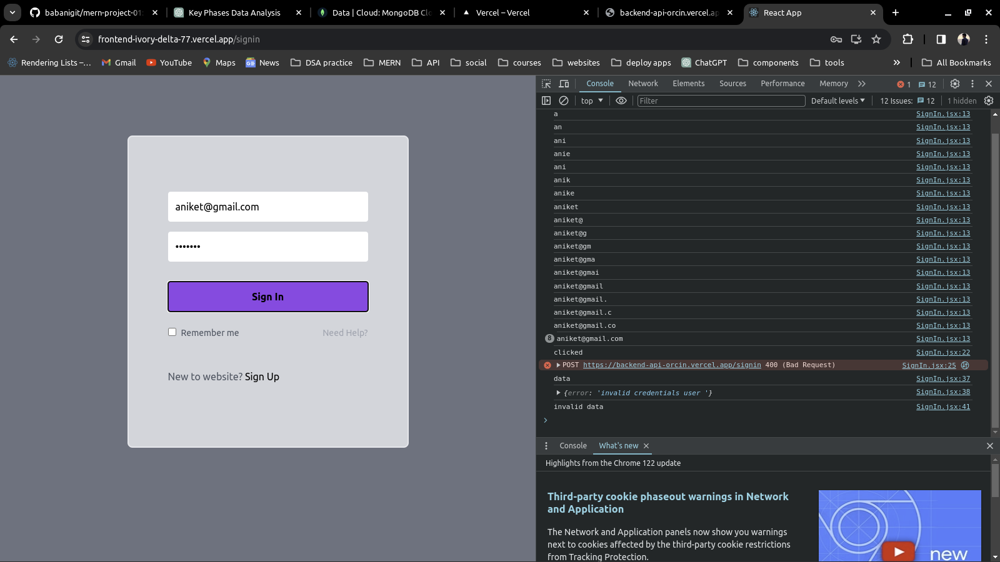
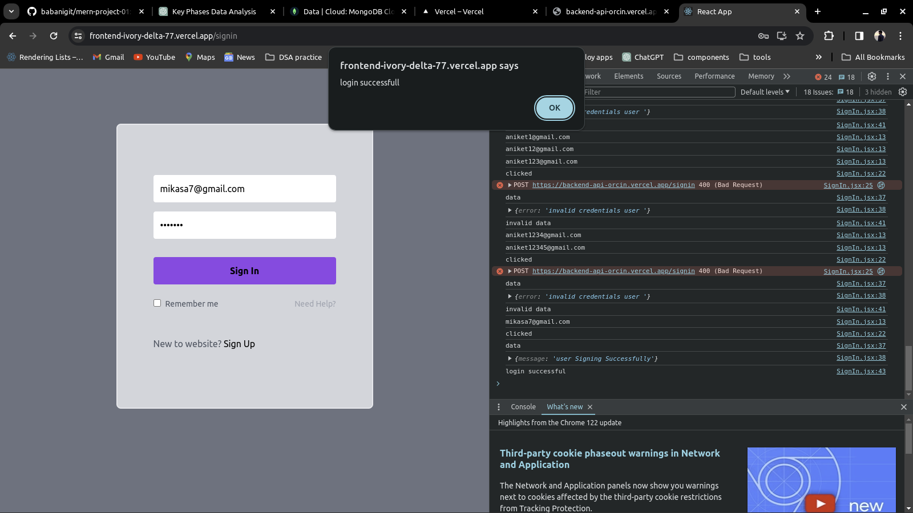
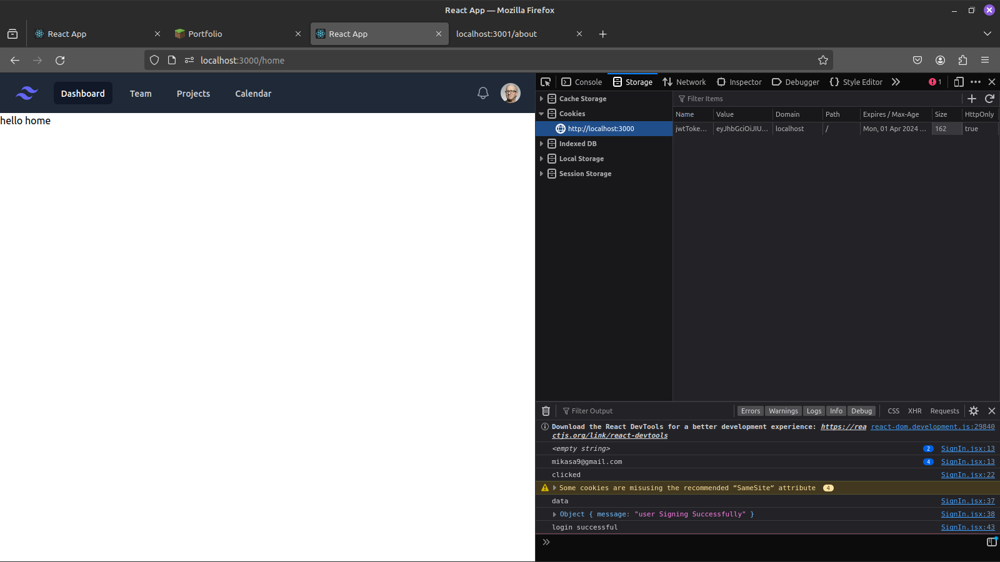
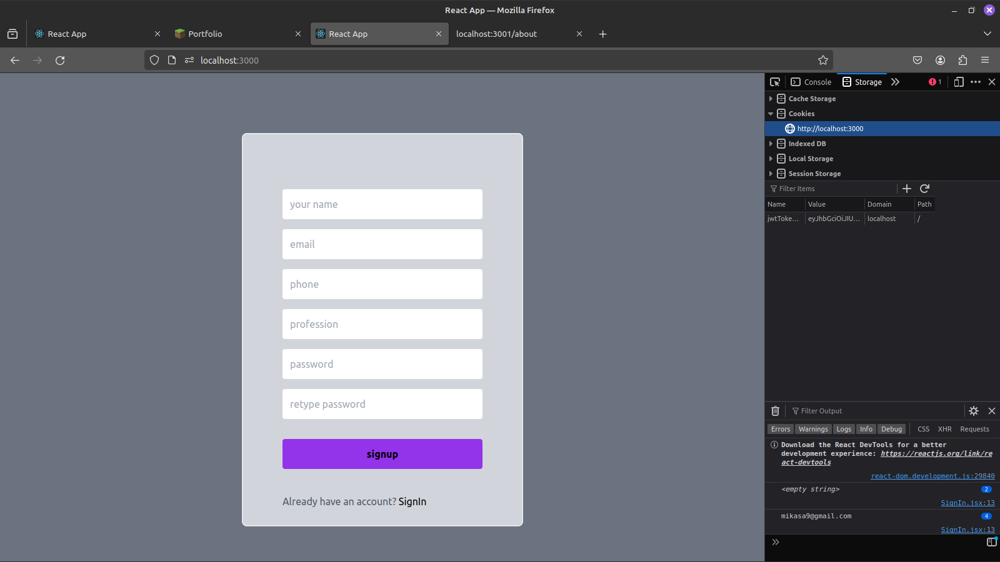

# mern-project-01

The backend and frontend components are seamlessly connected through Vercel.app, facilitating a robust and efficient integration between server-side and client-side functionalities. Leveraging Vercel.app's deployment and hosting capabilities, the platform ensures reliable communication and smooth interaction between the backend server and frontend user interface.

fronted - "https://frontend-ivory-delta-77.vercel.app"
backend_api - "https://backend-api-orcin.vercel.app/"

